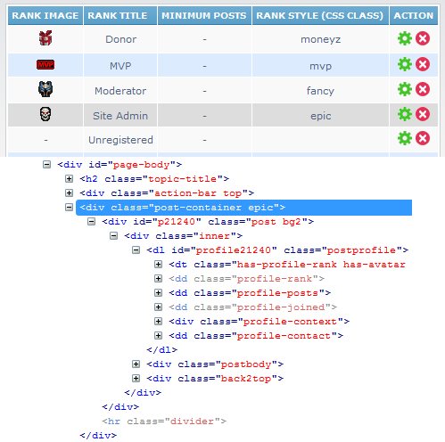

Rank Post Styling for phpBB 3.1
===============

Extension for phpBB 3.1 that adds a CSS rule option to user ranks. Useful for styling posts of special users.

## Features
- Integration with phpBB 3.1 ranks ACP module
- Allows admin to specify a CSS class rule for each "special" rank
- CSS class rule is applied to `
` which wraps posts
- Available in:
  - Viewtopic
  - Search results (posts mode)
  - Memberlist (viewprofile)
- Gives total control to style whatever you like (fonts, colors, images, etc.)  

#### Warning!
This extension is only for those that are familiar with HTML and CSS. No support will be given beyond the actual functionality of the extension. All styling is up to you.

#### Requirements
- phpBB 3.1.0 or higher
- PHP 5.3.3 or higher

#### Languages supported
- English
- Spanish
- Arabic
- Croatian

## Installation
1. [Download the latest release](https://github.com/PayBas/RankPostStyling/releases) and unzip it.
2. Copy the entire contents from the unzipped folder to `phpBB/ext/paybas/rankpoststyling/`.
3. Navigate in the ACP to `Customise -> Manage extensions`.
4. Find `Rank Post Styling` under "Disabled Extensions" and click `Enable`.

## Uninstallation
1. Navigate in the ACP to `Customise -> Manage extensions`.
2. Click the `Disable` link for `Rank Post Styling`.
3. To permanently uninstall, click `Delete Data`, then delete the `rankpoststyling` folder from `phpBB/ext/paybas/`.

### License
[GNU General Public License v2](http://opensource.org/licenses/GPL-2.0)

© 2015 - PayBas